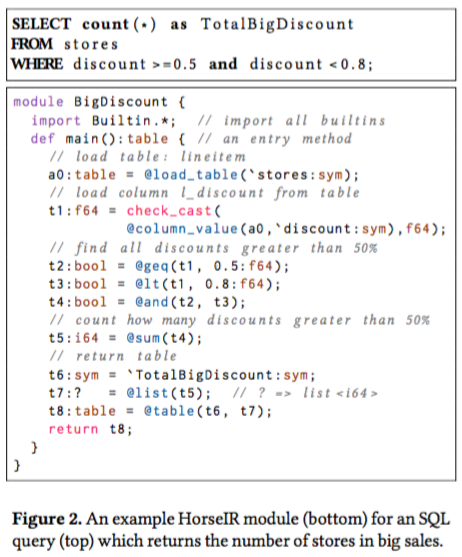
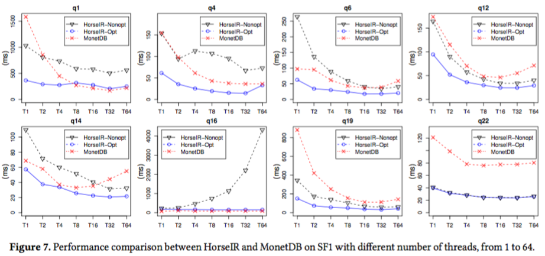
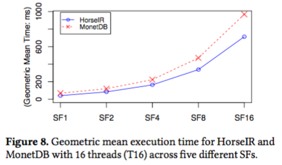
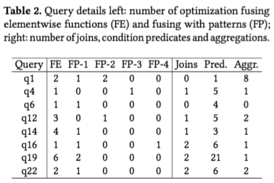
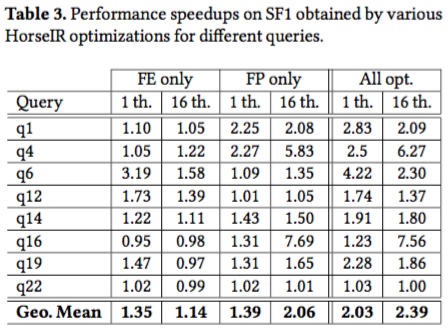

# HorseIR


1. [Getting started](#1-gettting-started)
2. [Prerequisites](#2-prerequisites)
3. [Database configuration](#3-database-configuration)
4. [Experiments](#4-experiments)
5. [Results](#5-results)
6. [Contact](#6-contact)

## 1. Getting started

The title of our paper submitted to DLS18 is

**HorseIR: Bringing Array Programming Languages together with Database Query Processing**

This repository is created for showing the reproducibility of our experiments
in this paper.  We provide the details of scripts and original data used in the
experiments.  There are mainly two systems: *HorseIR* and *RDBMS MonetDB*.  We
supply step-by-step instructions to configure and deploy both systems in the
experiments.

In this repository, you will find:

- the software you need to install (<u>[Sec. 2](#2-prerequisites)</u>);
- how to configure databases (<u>[Sec. 3](#3-configure-databases)</u>);
- how to run experiments (<u>[Sec. 4](#4-experiments)</u>);
- the results used in the paper (<u>[Sec. 5](#5-results)</u>);
- the contacts if you have any further questions (<u>[Sec. 6](#6-contact)</u>).

*The logo was based on an anonymous horse and [Laurie's
dragon](http://www.cs.mcgill.ca/~cs520/2017/images/dragon.lowres.jpg).*

<p align="right"> <a href="#horseir"> Back to top </a> </p>

## 2. Prerequisites

Let `DIR_EXP` be the directory where the experiments take place.
In our local tests, we used

    DIR_EXP=/mnt/local

Please install the following systems before you go to next sections.

    - TPC-H: version v2.17.0
    - GCC-7: version v7.2.0
    - MonetDB: version Jul2017-SP2
    - HorseIR

### TPC-H

```shell
    # TPC-H (found in ./exp/query/)
    unzip tpc-h-tool.zip
    cd tpch_2_17_0/dbgen
    make
    # Generate data with scale factor 1.
    ./dbgen -s 1
```

In our local tests, we selected 8 queries which were saved in

    <DIR_EXP>/query/chf/

Moreover, 5 databases with 5 different scale factors (SF 1/2/4/8/16) were created as
follows.

```shell
    # SF 1
    mkdir <DIR_EXP>/tpch-tbl/db1
    ./dbgen -s 1
    mv *.tbl <DIR_EXP>/tpch-tbl/db1
    # ... repeat for SF 2, 4, 8, 16
```

Then, after you check the directory `tpch-tbl`, you can see 5 folders.  In each
folder, it contains different sizes of data.

```shell
    ls <DIR_EXP>/tpch-tbl
db1  db16  db2  db4  db8
```

Reference: [TPC - Current
specifications](http://www.tpc.org/tpc_documents_current_versions/current_specifications.asp)

### GCC-7

***Note:*** about 5 hours spent on compiling GCC from source code.

```shell
    # Download GCC-7
    wget https://ftp.gnu.org/gnu/gcc/gcc-7.2.0/gcc-7.2.0.tar.gz
    tar -xf gcc-7.2.0.tar.gz
    cd gcc-7.2.0
    ./contrib/download_prerequisites
    ./configure --prefix=<DIR_EXP>/gcc
    make
    make install
    # set alias
    ln -s <DIR_EXP>/gcc/bin/gcc <DIR_BIN>/gcc-7
```

*The directory `DIR_BIN` is the directory which has been included in `PATH`.*

### MonetDB

```shell
    # Download MonetDB 2017-SP2
    wget https://www.monetdb.org/downloads/sources/Jul2017-SP2/MonetDB-11.27.9.tar.bz2
    tar -xf MonetDB-11.27.9.tar.bz2
    cd MonetDB-11.27.9
    # configure with performance flags enabled
    ./configure --prefix=<DIR_EXP>/monetdb17 --enable-debug=no --enable-assert=no --enable-optimize=yes
    make
    make install
    # set alias
    ln -s <DIR_EXP>/monetdb17/bin/mclient  <DIR_BIN>/mclient
    ln -s <DIR_EXP>/monetdb17/bin/monetdb  <DIR_BIN>/monetdb
    ln -s <DIR_EXP>/monetdb17/bin/monetdbd <DIR_BIN>/monetdbd
    ln -s <DIR_EXP>/monetdb17/bin/mserver5 <DIR_BIN>/mserver5
```

*The directory `DIR_BIN` is the directory which has been included in `PATH`.*

Create a configuration file `~/.monetdb` with the following content:

```no-highlight
user=monetdb
password=monetdb
language=sql
```

Then, type `mclient` to login MonetDB.  Please check if you see the version
number `Jul2017-SP2` on the top of the welcome message.  Moreover, try the
following command to see if the database has been installed successfully.

```no-highlight
sql>SELECT 'Hello world';
+-------------+
| L2          |
+=============+
| Hello world |
+-------------+
1 tuple (1.328ms)
```

Reference: [How to install MonetDB and the instroduction of server and client
programs.](https://www.monetdb.org/Documentation/Guide/Installation)


### HorseIR

Download HorseIR project from GitHub

```shell
    git clone git@github.com:Sable/HorsePower.git
    cd HorsePower
    git checkout 34ca12ac4e725e8e1c8e9d5061904c752130bd76
```

Download and install libraries (about 7 minutes)

```shell
    (cd libs && sh deploy_linux.sh)
```

Setup experiments

```shell
    # build HorseIR system
    (cd exp-dls18 && ./setup)

    # setup and generate HorseIR programs from execution plans
    (cd exp-dls18 && ./setup_translator)
```

External links

- A LL-based grammar for the HorseIR translator: [click here](http://www.sable.mcgill.ca/~hanfeng.c/horse/docs/research/hyper/#horseir-translator)

<p align="right"> <a href="#horseir"> Back to top </a> </p>

## 3. Database Configuration

### 3.1 MonetDB

We need to create

- 1 data farm, `TPCH`; and
- 5 TPC-H related databases, `tpch1/2/4/8/16`

***Note:*** In each TPC-H related database, there are 8 tables: `part`, `supplier`,
`partsupp`, `lineitem`, `customer`, `nation`, `region`, and `orders`.

Create a datafarm

```shell
    monetdbd create TPCH
    monetdbd start TPCH
```

Create and release database 'tpch1' (similar for database tpch2/4/8/16)

```shell
    monetdb create tpch1
    monetdb release tpch1
    monetdb start tpch1
```

Login a database

```shell
    mclient -d tpch1
```

Load data to TPCH (inside mclient)

```
    # create empty tables
    \< <DIR_EXP>/tpch_2_17_0/dbgen/dss.ddl
    # import data (should replace /mnt/local with <DIR_EXP> in initTPCH1.txt
    \< <DIR_EXP>/script-tpch/initTPCH1.txt
```

### 3.2 HorseIR

Remember to set soft aliases for your data created in TPC-H, so that data
copies can be avoided.

```shell
    cd src/HorseIR/data
    ln -s <DIR_EXP>/tpch-tbl tpch
```

<p align="right"> <a href="#horseir"> Back to top </a> </p>

## 4. Experiments

The overview of the machine used in our local test is

- Server named, `Sable-Intel`
- 4 Intel Xeon E7-4850 2.00 GHz
- Total 40 cores with 80 threads
- 128GB RAM
- Ubuntu 16.04.02 LTS

### 4.1 Run MonetDB with TPC-H queries

***Note:*** by default, MonetDB uses all 80 threads with `mclient`.  Therefore,
we need to use `mserver5` instead to set the number of threads to, for example,
40.

```shell
# SF 1
mserver5 --dbpath=<DIR_EXP>/datafarm/TPCHDB/tpch1 --set monet_vault_key=<DIR_EXP>/datafarm/TPCHDB/tpch1/.vaultkey --set gdk_nr_threads=40
```

Then, a new terminal should be opened and run MonetDB with the following command:

```shell
# SF 1
(cd <DIR_EXP>/script-tpch && time ./runtest | mclient -d tpch1)  &> summary1.log
```

Finally, exit mserver5 by typing `\q` or `CTRL+D`.
Repeat the process for SF 2, 4, 8, and 16.

In each log file (e.g. `<DIR_EXP>/script-tpch/sf1/\*.log`), search for the
keyword `avg_query` to identify **the average of the last 10 runs**.  The
details of the 10 runs can be found just above it with a single-column table
(i.e. query\_time).


### 4.2 Run HorseIR with TPC-H queries

Run HorseIR with 8 queries and 15 times on SF 1/2/4/8/16, and report the average execution time (ms)

```shell
    # base dir is 'HorsePower'
    (cd exp-dls18 && time ./run_all.sh)
```

The script `run_all.sh` sets different scales and invokes the script
`test-thread.sh` for each scale. The script `test-thread.sh` computes each
query 15 times and returns the average.  As a result, all output information is
saved into a log file, for example, `sf1/log_thread_1.log` contains the
information of all queries for SF 1.

Fetch brief information from a log file

```shell
    cat sf1/log_thread_1.log | grep -E 'Run with 15 times|HorseIR Optimization Level'
```

All log files can be found in the folder [exp/script-tpch](./exp/script-tpch)

## 5. Results

***Note:*** *You can click a figure on the left side to see its original figure.*

### Figures

<table>
<tr>
<th>Table overview</th>
<th>Description</th>
</tr>

<tr>
<td width="50%">  </td>
<td>
An example HorseIR module
</td>
</tr>

<tr>
<td width="50%">  </td>
<td> 
See details in <a href="exp/plot">data and scripts for Figure 7.</a>
</td>
</tr>

<tr>
<td>  </td>
<td> 
See details in <a href="exp/plot">data and scripts for Figure 8.</a>
</td>
</tr>
</table>

### Tables

<table>
<tr>
<th>Figures</th>
<th>Description</th>
</tr>

<tr>
<td width="50%">  </td>
<td> 
See details in
<a href="exp/query/chf">the selected 8 queries.</a>
</td>
</tr>

<tr>
<td>  </td>
<td> 
See details in 
<a href="./exp/script-tpch/sf1/" target="_blank">MonetDB-thread-1-log</a>,
<a href="./exp/script-tpch/sf2/" target="_blank">MonetDB-thread-2-log</a>,
<a href="./exp/script-tpch/sf4/" target="_blank">MonetDB-thread-4-log</a>,
<a href="./exp/script-tpch/sf8/" target="_blank">MonetDB-thread-8-log</a>, and
<a href="./exp/script-tpch/sf16/" target="_blank">MonetDB-thread-16-log</a>,
</td>
</tr>
</table>

<p align="right"> <a href="#horseir"> Back to top </a> </p>

## 6. Contact

If you have any questions regarding MonetDB or HorseIR, such as database
configuration problems, please contact
Hanfeng Chen ([hanfeng.chen@mail.mcgill.ca](mailto:hanfeng.chen@mail.mcgill.ca)).


